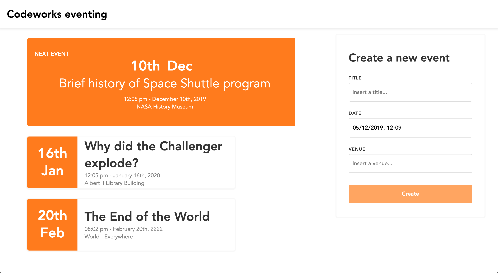

# Start app
**Step-by-step:**
## DB
You must have mongodb configured and running in the background in order for the app to work! Go to `./server/.env` to change the desired DB path on your local machine.

## Start server
1) `cd server`
2) `npm i`
3) `npm run start`
4) `cd ..`

## Start client
1) `cd client`
2) `npm i`
3) `npm run start`

Open 'http://localhost:3000'

# CODEWORKS Description

# Weekly assessment 6 (4 hours)

This is your final weekly assessment, it sums up many concepts you’ve learned in the junior part of the course, and it marks your passage to the senior part.

You have to create a full-stack app to post and find events.

Make sure to:

- Use proper indentation.
- Comment your code where needed.
- Lint your code before committing.
- Commit often and follow the [Semantic Commit Message](https://seesparkbox.com/foundry/semantic_commit_messages) convention.

## Front End

Start by creating the Front End, in the meantime you can use the Back End we provide at `https://cw-events-092017.herokuapp.com/`. You can find all its documentation in the next section here below.

The provided Back End is shared between everyone, so expect some events that you don’t create to be listed. Please, be respectful of others and polite with the events you create.

We encourage you to put all the *Presentational Components* in the `components` folder and the *Container Components* in the `containers` folder.

- Use the React CLI to set-up the client folder, running `create-react-app client`.
- Your app should allow users to do the following:
  - View a list of the next upcoming events sorted by the most recent (see the wireframe).
  - Add a new event. When a new event is added, the event list should reflect the changes automatically and the form fields should be cleaned.



### Specks 🥓

- On the form:
  - Title's input should contain the attribute name, set to `title`.
  - Venue's input should contain the attribute name, set to `venue`.
  - Datetime's input should contain the attribute name (set to `date`) and the attribute type (set to `datetime-local`).
  - The form should contain a `type=submit` input/button that should trigger the submission of the form.
- On the list of events:
  - The container list should have `id=list`.
  - It should contain all the events, but the first one should render differently, containing the sentence "Next Event".

## Back End

Substitute the provided back-end with your own implementation.

Create a `/server` folder and implement an [Express](https://expressjs.com/) REST server connected to a MongoDB database with [Mongoose](http://mongoosejs.com/). It should offer the following API methods:

- `POST /events` - Creates a new record in the database with the following parameters:

  - `title`: *String*. A descriptive title for the event.
  - `date`: *DateTime (ISO 8601).* Date and Time of the event.
  - `venue`: *String*. Where the event is taking place.

  All these parameters are mandatory. The server should return a `200` status code for success, and a `400` HTTP status code in case any parameter is missing.

- `GET /events` - Returns a list of all events stored in the database, in JSON format. 

  ```json
  [
    {
      "id": "…",
      "title": "Brief history of Space Shuttle program",
      "date": "2016-10-29 19:00:00+01:00",
      "venue": "NASA History Museum"
    },
    {
      "id": "…",
      "title": "Why did the Challenger explode?",
      "date": "2016-11-31 18:30:00+01:00",
      "venue": "Albert II Library Building"
    }
  ]
  ```

## Extra credits

- Show a loader (e.g. spinner) when fetching the event list.
- Create an `ApiClient` service as a JavaScript Module that shares the logic for calling `fetch` and abstracts it behind methods (i.e.: `apiClient.getMessages()`).

## Experimental 👩‍🔬

We're testing your submissions with Cypress (end-to-end testing)! This is completely optional, so focus first on completing the requirements, don't worry if the tests don't pass.

You have two different options for running the test locally:

- `npm t`: This one will run the Cypress test runner only. That means that your client and server should be up and running (listening to 3000 and 3001 respectively). Also, the database should be up and listening.

- `npm run test:open`: This option is the same as the previous one, but it opens cypress' browser so you can see what it does. So cool!